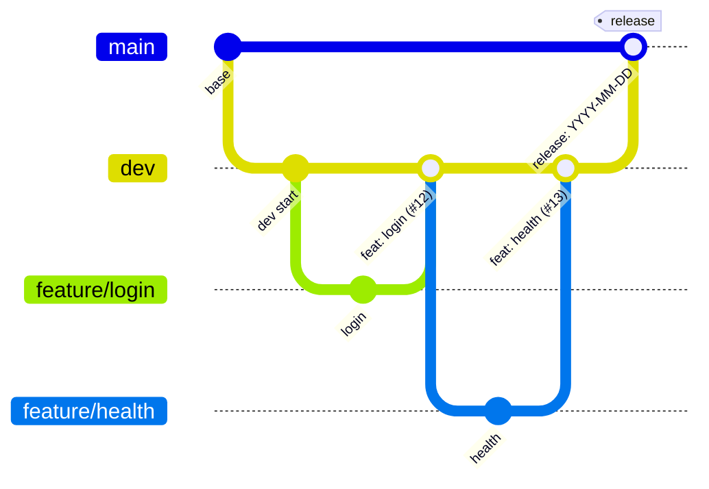
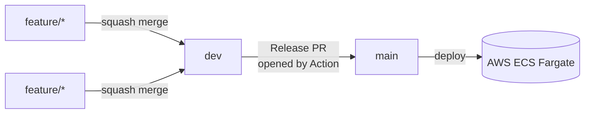

# github-actions-aws-deploy

Minimal [NestJS](https://nestjs.com/) service exposing a single healthcheck
endpoint. It is intentionally small — its purpose is to be the base application
for a complete CI/CD pipeline that builds a Docker image and deploys to
**AWS ECS Fargate** via **GitHub Actions**.

## Stack

- NestJS 11 (Express) + TypeScript
- `@nestjs/terminus` for health checks
- Multi-stage Docker build, runs as a non-root user
- Node.js 20

## Endpoints

| Method | Path      | Description                                         |
| ------ | --------- | --------------------------------------------------- |
| `GET`  | `/health` | Terminus healthcheck (heap memory). Returns `200` when healthy. |

Example response:

```json
{
  "status": "ok",
  "info": { "memory_heap": { "status": "up" } },
  "error": {},
  "details": { "memory_heap": { "status": "up" } }
}
```

## Getting started

```bash
npm install
cp .env.example .env      # optional, only to override PORT
npm run start:dev         # http://localhost:3000/health
```

## Useful scripts

| Script                | What it does                          |
| --------------------- | ------------------------------------- |
| `npm run start:dev`   | Run in watch mode                     |
| `npm run build`       | Compile to `dist/`                    |
| `npm run start:prod`  | Run the compiled build                |
| `npm test`            | Unit tests                            |
| `npm run lint`        | Lint & autofix                        |

## Docker

```bash
docker build -t github-actions-aws-deploy .
docker run --rm -p 3000:3000 github-actions-aws-deploy
curl http://localhost:3000/health
```

The image is multi-stage (build deps are dropped), runs as the unprivileged
`node` user, and declares a `HEALTHCHECK` against `/health`.

## Git flow & releases

This project uses a two-branch flow:

- **`main`** — production. Only ever updated through a **release PR**.
- **`dev`** — integration branch. Everything lands here first.

Work happens on short-lived **feature branches** that are merged into `dev`
(squash merge, so each feature becomes a single commit ending in `(#N)`).
When `dev` is ahead of `main`, a **release** is simply a PR from `dev` → `main`
bundling all of those features together.



Flow at a glance:



### The `Open Release PR` action

The [`release-pr.yml`](.github/workflows/release-pr.yml) workflow automates the
`dev → main` release PR so nobody has to assemble it by hand.

What it does, step by step:

1. **Checkout `dev`** with full history (`fetch-depth: 0`) so it can diff against
   `main`.
2. **Resolve metadata** — builds the PR title in the format `release 1: <date>`
   using the `America/Sao_Paulo` timezone.
3. **Build the PR body** — fetches `main`, then:
   - If there are **no new commits** between `main` and `dev`, it logs a message
     and exits cleanly (`has_commits=false`) so the run stays green instead of
     failing on an empty release.
   - Otherwise it scans the commit subjects for the squash-merge `(#N)`
     references, deduplicates and sorts them, and renders the body using the
     [release template](.github/PULL_REQUEST_TEMPLATE/release.md).
4. **Create or update the PR** — if an open `dev → main` PR already exists it is
   updated in place; otherwise a new one is created. This step is skipped when
   there are no commits to release.

How it runs:

- **Manually** via `workflow_dispatch` (Actions tab → *Open Release PR* → *Run
  workflow*).
- **On a schedule** (currently commented out): a daily cron at 20h BRT / 23h UTC.
  Uncomment the `schedule` block in the workflow to enable it.

It only needs the default `GITHUB_TOKEN` with `pull-requests: write`.

## Next step: the pipeline

This repo is ready to be wired to a GitHub Actions workflow that:

1. Installs deps, lints and tests.
2. Builds the Docker image and pushes it to **Amazon ECR**.
3. Renders a new **ECS task definition** and deploys it to **Fargate**.

Authentication to AWS should use **OIDC** (GitHub → IAM role), not long-lived
access keys.

adicionando teste no MD 123123
